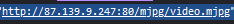

# Live Image Capture to Video

This script captures live images from a given URL of insecam.org site and creates a video with faster FPS. 
the captured video is automatically save in local directory.

## Prerequisites

- Python 3.x
- OpenCV (`pip install opencv-python`)

## Usage

1. Clone the repository or download the `liveCam.py` file.

2. Install the required dependencies by running the following command:

pip install opencv-python

4. Use the URL of live camera grabbed from insecam site.
3. Run the script with the desired options:

python liveCam.py -u '<URL>' [-f <FPS>] [-n <num_images>]

Note: URL link must be in the single Single quotes.
========>

- `<URL>`: URL of the live image capture link (required).
- `<FPS>`: FPS (frames per second) of the output video (optional, default is 24.0).
- `<num_images>`: Number of images to capture (optional, default is 100).

4. The script will start capturing live images from the provided URL and display them in a window. Press 'q' to stop the process.

5. Once the capturing is complete, the script will generate a video file named `output.avi` in the same directory.

## how grab specific live camera URL from insecam site
1. chose a live camera you what to run with the script.

2. go to inspect mode and click on the live camera

3. copy the link and use it in script

## Example

To capture images from a live image capture link and create a video with a frame rate of 30 FPS and 200 images, run the following command:

python liveCam.py -u http://193.248.135.223:80/cgi-bin/viewer/video.jpg?r=COUNTER -f 30 -n 200

The script will start capturing images from the provided URL, and once the capturing is complete, it will save the video as `output.avi`.

